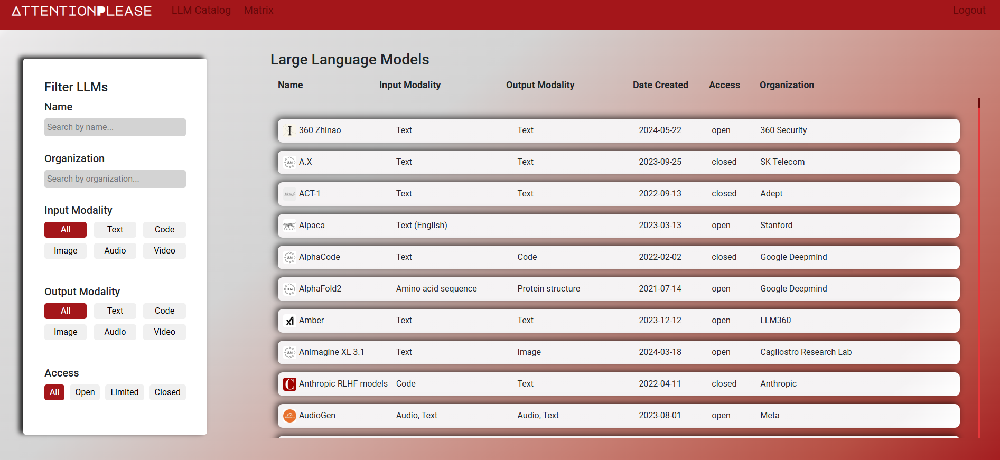
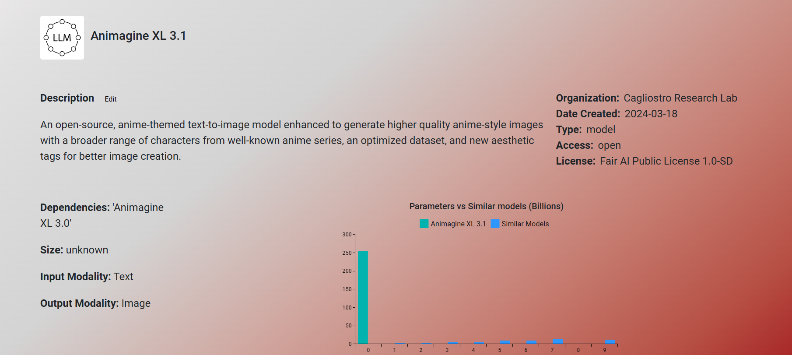
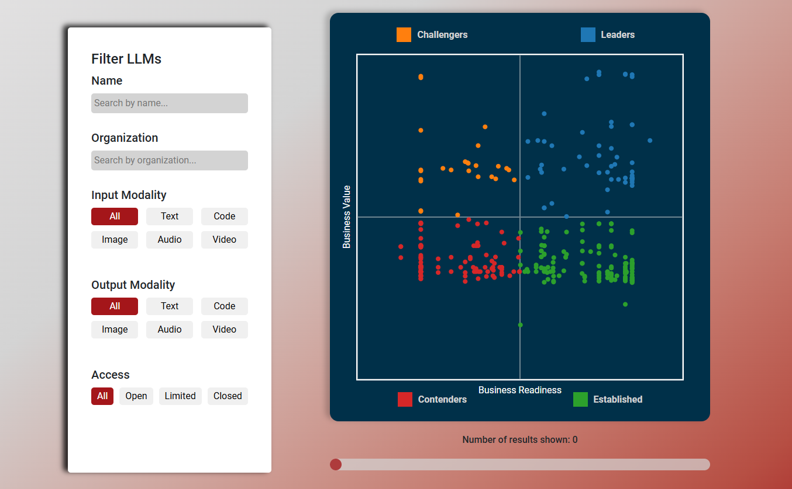
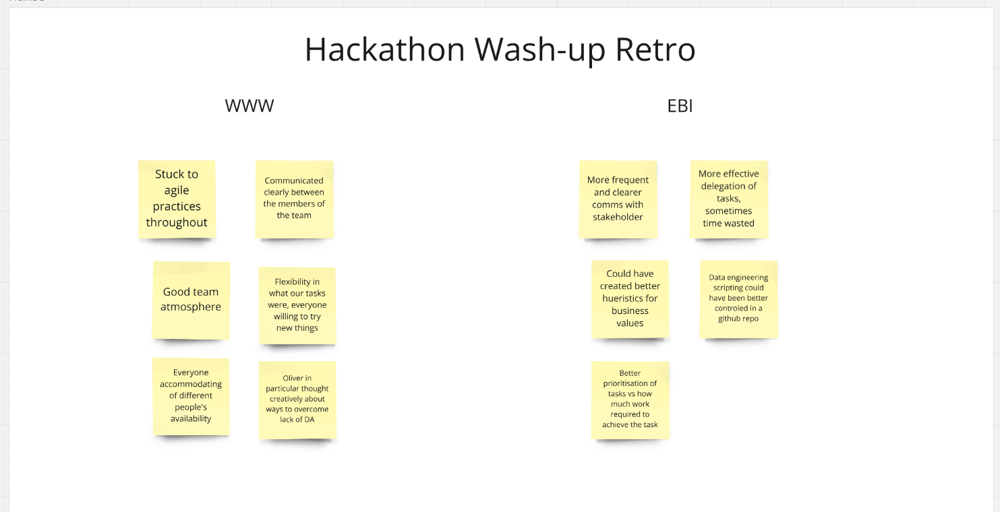

### HorizonX / Digital Futures LLM Catalogue Hackathon

This is the submission by Julian Humble, Hugh Pullman, Oliver Just-De Bleser, and Arian Bahadori for a 1.5-week Hackathon set by HorizonX in collaboration with Digital Futures to create a online catalogue of LLMs allowing business experts and AI researchers to effectively browse and query different models which may be suitable for their needs. Part of the deliverable was to create a matrix similar to the Magic Quadrant by Gartner, plotting the business readiness and percieved business value of the LLMs.

We built the front-end using React and made the various charts and matrices using MUI X Charts. We chose these technologies as had used React before and wanted to deepen our experience with it, and were interested in learning the features of the MUI libraries as a new learning experience.

We then built the backend service using Express/Node.js with Mongoose to connect to our database, as these were backend technologies we had used before and we looked to consolidate our familiarity with them.

We developed and implemented ETL (Extract, Transform, Load) processes using Python and learned Selenium for automating logo extraction and web scraping from websites. The database provided to us was PostgreSQL, which we decided to migrate to a online-hosted MongoDB Atlas database, which is a NoSQL database. We did this to integrate the data better with the backend created by the software engineers.

We integrated multiple data sources into a unified table, enhancing teamwork and collaboration skills. We overcame challenges, including limited API calls and difficulties in finding comprehensive logo APIs. We conducted data transformation tasks such as separating data into distinct columns and removing duplicate data.

To supplement our limited data set, we decided to augment and generate new data. This was first done by gathering news articles, using [the News API](https://newsapi.org/), relating to the organizaiton with regards to AI in buisness, the number of articles was counted and appended as well as the average sentiment of these articles which was calculated using a [VADER analyzer available through NLTK](https://www.nltk.org/_modules/nltk/sentiment/vader.html). Secondly, we used the OpenAI GPT-4o api to estimate the size of the model based on a description of the model to fill missing size values, these were given a seperate column to highlight the fact that these were infact unvalidated estimates. These values were normalized and incorporated into our business readiness and business value values which allowed us to plot all of the models provided to us on our 'LLM matrix', serving a similar usecase to the Gartner Magic Quadrant.

We worked using Agile practices & methodologies, sharing a Miro board to create Kanban boards and various wireframes. We split the project into two sprints, holding a retrospective at the end of the first sprint to ensure we completed the story points we set out to achieve. We also completed daily standups as a team at 4pm each day of the event.

